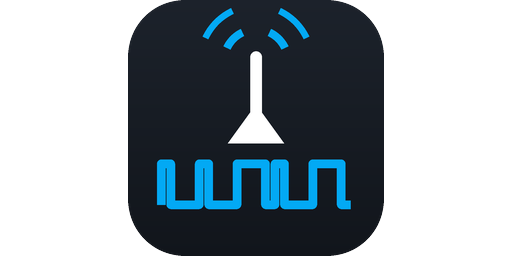

[](https://github.com/semichcsc-byte/rfxcom-commands/actions/workflows/validate.yml)
[](https://hacs.xyz)

Learn 433 MHz remotes with an RFXCOM and get a Home Assistant button or switch
for each one — including remotes the RFXCOM cannot decode.

## Read this before installing

**The learning flow took a production Home Assistant down three times, and while
a mechanism that would do exactly that has since been found and fixed, it has
not been confirmed as the cause.**

The symptom was that Home Assistant stopped responding entirely a short while
after a capture: the port still accepted TCP connections but nothing was served,
while the host itself stayed healthy and the Supervisor eventually restarted
Core. It needed a manual reboot each time.

What was found: the capture loop awaited a queue, and awaiting a queue that
already holds an item never reaches the event loop. Home Assistant runs
everything on one loop, so a capture over a busy band could freeze it outright.
[tests/test_event_loop.py](tests/test_event_loop.py) reproduces it — without the
fix the loop gets zero cycles for the whole capture window — and the fix is a
yield on every iteration.

What is still unproven: whether that alone explains the outages. One of them
happened with this integration disabled, which no fix here can account for.

Two of the three outages were caused by defects that no longer exist, and the
test suite now covers the paths involved. Even so, **treat this as experimental
on a Home Assistant you depend on.** The capture and decoding logic in
[tools/rfx_capture.py](tools/rfx_capture.py) runs outside Home Assistant and
carries none of this risk — if you only want to read a remote, start there.

## Why this exists

The RFXCOM integration works from a list of known protocols. Point a remote at
it that speaks something else and the best you get is an `Undecoded` event with
a couple of bytes in it, which is not enough to identify the button, let alone
reproduce it.

The device can do better. RFXtrx firmware has a raw mode that reports the
actual pulse timings, and a matching transmit packet that plays arbitrary
timings back. That is the same capture-and-replay trick a Broadlink uses, and
it works on remotes no protocol decoder recognises. It is just not exposed
anywhere: no Home Assistant UI, and the Python library the integration uses
throws the packets away before they reach an event.

This integration turns that raw mode into a learning flow. Press a button, get
an entity.

## What you need

- Home Assistant 2025.3 or newer
- The built-in **RFXCOM RFXtrx** integration already set up and working
- An RFXtrx433 (any variant) or RFX-433EMC

The serial port takes a single reader, so this integration never opens its own
connection. It borrows the one the core integration already has. If RFXCOM is
not set up, this will tell you so and stop.

## Install

### With HACS

1. Open **HACS**
2. Top right **⋮** → **Custom repositories**
3. Repository: `https://github.com/semichcsc-byte/rfxcom-commands`
4. Type: **Integration** → **Add**
5. Search HACS for *RFXCOM Commands*, open it, press **Download**
6. Restart Home Assistant

### Without HACS

Copy the `custom_components/rfxcom_commands` folder into your Home Assistant
`config/custom_components/` folder, so you end up with
`config/custom_components/rfxcom_commands/manifest.json`. Restart Home
Assistant.

## Set up

Go to **Settings → Devices & services → Add integration** and search for
**RFXCOM Commands**. There is nothing to configure — it finds your RFXCOM
integration by itself.

## Learn a command

On the integration's page, press **Learn a command**, then press the button on
your remote, within a few metres of the RFXCOM.

One press is enough, and the dialog closes as soon as it has the command. A
remote does not send its code once: a single press carries the same frame four
or so times over, and the capture is only accepted when those repeats agree
with each other. That is what separates a real command from a neighbour's
doorbell, and it is why nothing more is asked of you. If the press was missed,
it keeps listening for twenty seconds — press again.

Then name the command, choose whether it should be a **button** or a
**switch**, and pick an area. Tick **Test before saving** to transmit it and
check it does the right thing; nothing is saved until you leave that box
unticked, so try as often as you like.

Each command you save becomes an entity, grouped under the gateway.

## Button or switch

Pick **button** when the remote's button does one thing: a doorbell, a scene,
"fan up".

Pick **switch** when the remote's button toggles something on and off, which is
what most ceiling fan lights do. There is only one code, so both buttons send
the same thing; the switch just remembers which way it last asked for. It has
no way to know what actually happened, so it is marked as assumed state. If it
drifts out of step — someone used the physical remote, or a transmission was
lost — press it again. It always transmits, even when the state already looks
right, because that is the only way back.

## Repeats

Every command is sent at the firmware maximum of ten repeats, and this is not
configurable. A lower count only makes a marginal link worse.

Sending the command twice to be safe is worse still, and not for the obvious
reason: the ten repeats are a burst, which a receiver treats as one press, but
a second transmission is a *second press*. On a toggle that undoes the first.

### What happens behind the scenes

Raw reporting is only active when every receive protocol is enabled, so
learning switches them all on, captures, and then puts your previous selection
back. The change is written straight to the open connection, so your RFXCOM
keeps running throughout — no reload, no gap in coverage.

Nothing about your normal protocol list changes permanently, and transmitting
does not depend on it — once a command is learned, its button works with your
usual protocols active.

## Edit a command

Open the command from the integration's page.

Renaming it or moving it to another area keeps the same entity, so dashboards,
automations and scripts carry on working. Changing it between a button and a
switch does replace the entity. Tick **Capture the command again** to recapture
and keep everything else, or **Test it now** to fire it and see what happens.

## If something does not work

**Nothing gets captured.** Hold the remote closer, within a metre or so, and
hold the button down rather than tapping it. Check the batteries. If your
remote is 315 MHz or 868 MHz, an RFXtrx433 will never hear it.

**The button works sometimes.** This is the common one. The RFXtrx transmits on
433.92 MHz and many remotes sit slightly off that — 433.83 is typical. Cheap
receivers have a narrow enough filter that the difference matters, and you get
an intermittent link. Repeats are already at the maximum, so the fix is
physical: move the RFXCOM closer to the device, or reorient its antenna.
**The button does nothing at all.** Learn it again. If a second capture
produces the same bits and still does nothing, the remote is probably using
rolling codes, which cannot be replayed by anyone.

**Learning says the frames disagree.** Something else transmitted at the same
moment. Just try again.

## What this cannot do

- **Read state.** A learned command transmits; it never knows what happened.
  For a toggle-only remote, Home Assistant cannot tell whether the light ended
  up on or off. A switch keeps track of what it asked for, which is the best
  any one-way remote allows; accept that it and the light can drift apart.
- **Rolling codes.** Anything that changes its transmission between presses —
  most car remotes, most garage doors, KeeLoq — is replay-proof by design.
- **Hear its own transmissions.** Useful to know: pressing a button here will
  not fire an `rfxtrx_event`, so you cannot use that to confirm a send.

## How it works

The technical detail — the raw packet format, how the frames are decoded, and
how this was worked out — is in [docs/PROTOCOL.md](docs/PROTOCOL.md).

There is also a standalone script for capturing and decoding outside Home
Assistant, which is handy for debugging:

```
python3 tools/rfx_capture.py --log home-assistant.log
python3 tools/rfx_capture.py --port /dev/ttyUSB0 --seconds 30
```

It prints what RFXmngr prints — the packet type and the **HA code** for every
decoded packet, ready to paste into the RFXCOM integration's `event_code`
field — and additionally reassembles raw packets into a replayable command.

Install `pyRFXtrx` alongside it (`pip install pyRFXtrx`) and it also breaks each
packet down field by field, as RFXmngr's log pane does. Without it you still get
the packet type and the HA code.

That second part is the reason this project exists. RFXCOM's own workflow is to
read the HA code out of RFXmngr and paste it into Home Assistant, which works
well for a remote the firmware decodes. For one it does not, all you get is an
`Undecoded` packet carrying a couple of bytes, and those bytes are not stable:
one button pressed several times produced four different codes in testing,
while a second button on the same remote produced one of the same ones. There
is nothing there to build an entity on. The raw pulse train is the only thing
that identifies the button.

## Licence

MIT
