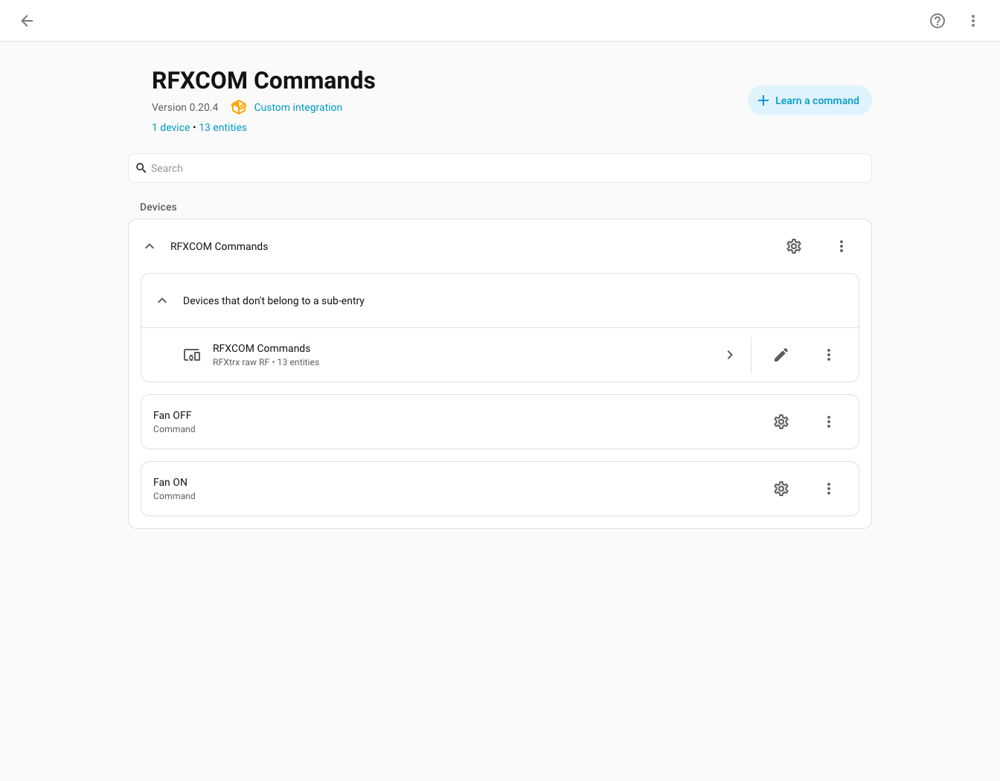
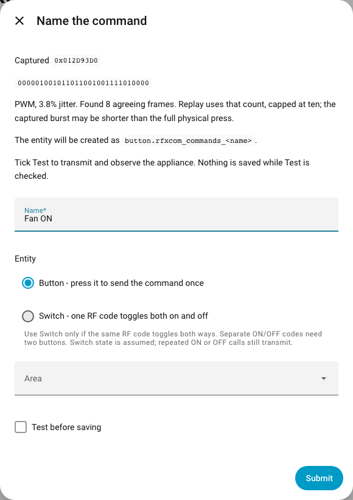
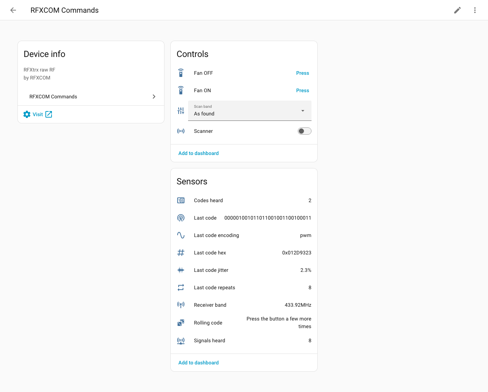

[](https://github.com/semichcsc-byte/rfxcom-commands/actions/workflows/validate.yml)
[](https://hacs.xyz)

Learn and replay RF commands with an RFXCOM and create Home Assistant buttons
or single-code toggle switches, including for remotes outside its built-in
protocol decoders.

## Why I built this

I built RFXCOM Commands for my own Home Assistant setup. I wanted to control
my fan with the RFXCOM I already had, even though its built-in decoders did not
recognise the remote. Capturing and replaying the raw signal made that possible.

It started as a solution for my home. I'm sharing it so others with compatible
hardware can use it too, learn from it and help improve it. It brings command
learning, buttons and scanner diagnostics into Home Assistant without needing
to work out the remote's protocol by hand.

## Demo screenshots

These screenshots show the real Home Assistant 2026.9 frontend with RFXCOM
Commands v0.20.4 in an isolated local demo. Names are examples; signal values
come from the recorded fan fixture. No production instance or live RF hardware
is used to generate the images. Click an image to view it at full size.

[](docs/images/commands.png)

*Saved ON/OFF commands on the integration page. Each command can be edited
independently; the Learn a command button starts a new learning flow.*

## Before you start

This is an independent community project, developed around my own equipment,
not an official [RFXCOM](https://www.rfxcom.com/) integration. Compatibility
depends on your receiver, firmware and remote.

Keep a current Home Assistant backup. Learning and scanning temporarily
interrupt normal RF protocol decoding; leave the scanner off when you are not
using it. See the [technical notes](docs/PROTOCOL.md#concurrency-and-capture-limits)
for known limitations and the history of stability issues, or use
[offline capture](#offline-capture) to investigate signals outside Home Assistant.

## Requirements

- Home Assistant **2026.9 or newer**, the tested baseline. Older releases are
  not supported.
- The built-in **RFXCOM RFXtrx** integration configured and connected.
- A receiver and firmware supporting RAW reception and transmission. Verified
  with an **RFX-433EMC, hardware 4.1**; other variants are not guaranteed.
- A remote on a band supported by that receiver. These tests used 433 MHz RF.

This integration borrows the native integration's connection. It never opens a
second serial reader. Raw mode reports pulse timings, not carrier frequency or
signal strength. Supported hardware bands cannot be expanded by software.

## Installation

### HACS

1. Open HACS and its **Custom repositories** menu.
2. Add `https://github.com/semichcsc-byte/rfxcom-commands` as **Integration**.
3. Find **RFXCOM Commands** and download the release.
4. Restart Home Assistant.
5. In **Settings > Devices & services > Add integration**, add **RFXCOM Commands**.

The native RFXCOM RFXtrx integration must already be working. Adding this
integration does not start a scan or transmit a command.

### Manual installation

Place the repository's `custom_components/rfxcom_commands` directory under the
Home Assistant configuration directory, then restart Home Assistant. The final
path must be `config/custom_components/rfxcom_commands/manifest.json`.

### Updating and recovery

Download the new version through HACS and restart Home Assistant. Reloading an
integration does not guarantee that imported Python modules have been replaced.
Confirm the installed version in HACS and check the integration's startup status.

An update does not automatically enable a disabled integration. To isolate a
problem, disable **RFXCOM Commands** in Devices & services; this is separate from
the native **RFXCOM RFXtrx** integration. Preserve logs before restarting an
unresponsive instance. Reinstalling an earlier release through HACS also requires
a restart and is not a guarantee that an older version is safer.

## Learning a command

1. Open the integration page and select **Learn a command**.
2. Submit the initial form, then press the desired remote button near the receiver.
3. When accepted, name the command, choose **Button** or **Switch**, and an area.
4. Optionally select **Test before saving**. This transmits RF and can operate
   the appliance. Observe the result directly.
5. Submit with the test option unchecked to save the entity.

The capture window lasts up to 20 seconds. Acceptance requires at least three
agreeing frames in a packet group. One physical press can contain enough
repetitions. Agreement reduces corrupted captures but does not identify which
physical remote sent them: nearby transmitters can also produce valid frames.

Closing the dialog cancels capture. Cleanup waits for in-flight mode writes and
attempts to restore the original receiver configuration.

[](docs/images/learn-command.png)

*Demo: the recorded ON command has been accepted and named Fan ON. Test before
saving is unchecked. The entity-ID placeholder is the actual pre-save preview;
it is not recomputed while typing the name.*

## Buttons and switches

Use a **button** for a specific command: ON, OFF, speed up, a scene or a doorbell.

Use a **switch** only when the same RF code toggles the appliance in both
directions. Both actions transmit that one code. Its state is assumed and
restored after a restart; it is not feedback from the appliance. Repeated ON or
OFF calls still transmit, even when the displayed state already matches. Such a
switch is not suitable for automations that require idempotent ON/OFF actions.

### Fan with separate ON and OFF codes

One physical button can alternate two commands. The captured fan remote does
this, and USB tests confirmed their effects:

| Action | Captured code | Agreeing frames |
|---|---|---|
| ON | `000001001011011001001111010000` | 8 |
| OFF | `000001001011011001001100100011` | 8 |

Learn these as **two buttons**, one per action. The current single-code switch
does not combine separate ON and OFF codes. These codes belong to the tested
remote, not a universal fan command. Capture data and observations are in
[the protocol notes](docs/PROTOCOL.md).

## Scanner and watch

The **Scanner** switch starts live RAW reception. Accepted captures update the
sensors and emit an `rfxcom_commands_raw` event. Rejected signals may increase
the packet counters without producing a decoded code.

| Sensor | Meaning |
|---|---|
| Last code hex | Accepted bits or signature expressed in hexadecimal |
| Last code | PWM bits, or a pulse-length signature for other encodings |
| Last code repeats | Number of agreeing frames in the accepted capture |
| Last code jitter | Deviation from the estimated short and long durations |
| Last code encoding | Heuristic classification: `pwm`, `ppm`, `manchester`, `unknown` |
| Signals heard | RAW packet count; attributes include rejection count and last reason |
| Codes heard | Distinct signatures in the bounded recent-code list |
| Rolling code | Repetition heuristic, not protocol identification |
| Receiver band | Band reported by the connection's cached receiver status |

The **Last code** attributes include pulse durations, frame and burst durations,
inverted signature, packet counts and recent codes. `address` is the common
prefix of recent signatures, not a verified device address. `bursts_dropped`
counts incomplete or out-of-order packet groups. Recent codes remain in memory
between scans until the integration reloads, so they can span different remotes.

Only PWM bits are decoded. Other signatures include both marks and spaces to
distinguish pulse patterns; they are not protocol payload bits. Transmission
uses normalized pulse durations, not the displayed signature.

Scanner, learning and **Configure / watch** share one exclusive capture session.
Stop the current session before starting another. The scanner stops after at
most 10 minutes, or sooner after 2,000 packets, overflow, cancellation or error.
Its `error` attribute retains startup or runtime failures. Normal protocol
decoding is interrupted during RAW capture, even though the serial connection
stays open.

**Configure** offers a bounded watch window and a written report. The
`rfxcom_commands.watch` action returns structured data and also emits events.
Its duration is 1 to 120 seconds, default 30. A transmit ACK is not a received
remote event and does not confirm the appliance's state.

**Scan band** requests a temporary band change. The library lists types that
the physical receiver may not support; a 433 MHz receiver is not made into a
315 or 868 MHz receiver by choosing an option. Cleanup attempts to restore the
original band and protocols. If the connection fails, check settings before
resuming normal use. Receiver-band metadata is not a measurement of the remote.

[](docs/images/scanner.png)

*Demo after processing two recorded presses: two codes, eight RAW packets and
eight agreeing frames in the last capture. The scanner is stopped; the band is
simulated receiver metadata, not a measured carrier frequency.*

## Transmission and repeats

Learned commands use the number of agreeing captured frames, capped at ten.
Capacity-limited reception can omit part of a physical press, so this count is
not necessarily the remote's full burst length. The learning UI has no repeat
setting. The fan ON/OFF tests succeeded with eight repeats.

More repeats are not necessarily better: some appliances may treat them as
multiple presses. Concurrent sends from this integration are serialized as
complete commands. Cancelling a send already in progress waits for its remaining
packets; it does not retract an RF transmission. Direct native `rfxtrx.send`
calls made outside this integration are not covered by that command-level lock.

## Editing commands

Open a saved command to rename it, change its area, test it or capture it again.
Renaming and moving preserve the entity ID. Changing Button to Switch or the
reverse replaces the entity; update dashboards and automations that reference it.
**Test it now** transmits without saving while checked.

## Troubleshooting

| Symptom | What to check |
|---|---|
| No packets | Receiver connection, remote battery, distance and supported RF band |
| Packets but no RAW | Firmware RAW support and mode selection |
| Only one usable frame | Use v0.20.3 or newer; if it persists, preserve a raw capture. It may be incomplete reception or unsupported framing |
| Frames disagree | Interference, reception errors or unsupported structure; do not bypass validation |
| Buffer overflow | Capture stops and attempts restoration. Investigate with short offline captures |
| Command acknowledged but no effect | Separate ON/OFF semantics, range, antenna, band compatibility and captured waveform |
| Switch state differs from appliance | State is assumed; physical remote presses and missed sends can cause drift |
| Already listening | Stop the scanner or close the other learning/watch session |

The **Rolling code** sensor cannot prove replay compatibility. A repeated
signature does not rule out rolling codes; changing signatures can be separate
ON/OFF commands, an alternating bit, or unrelated transmitters. This integration
does not implement rolling-code synchronization or pairing. Likewise, lack of
response alone does not diagnose a rolling-code remote.

For a report, include receiver model/firmware, HA and integration versions,
the exact error and a raw log from a short isolated capture. RF recordings may
contain identifiers or commands for nearby devices; inspect them before sharing.

## Offline capture

Connect the receiver to the computer running the tool. It needs exclusive
access to that serial port. Moving it from the HA host interrupts HA's RF
connection, but does not require stopping the entire HA instance.

```sh
python3 -m pip install pyserial pyRFXtrx
python3 -m serial.tools.list_ports -v
python3 tools/rfx_capture.py --port /dev/ttyUSB0 --seconds 30 --save-log capture.log
python3 tools/rfx_capture.py --log capture.log --raw-only
```

On macOS, use the RFXCOM's `/dev/cu.usbserial-...` port from the port listing.
`--save-log` creates a new file, refuses to overwrite an existing one and stores
every packet, including rejected RAW captures. Capture is capped at 120 seconds
and 2,000 packets. The tool restores and verifies the previous mode on exit;
check that confirmation before reconnecting the receiver to HA.

The tool prints packet details and transmit payloads but **does not transmit
RF**. `--repeats` controls the printed transmit payloads (default 10); it does
not change the HA learning UI. With pyRFXtrx installed it can also print fields
for packets supported by that library. It reads `[RFXtrx] Recv:` debug lines
from existing HA logs, but enabling debug alone does not enable RAW capture.

## Development and verification

Use Python 3.14, matching the pinned Home Assistant test harness:

```sh
python3.14 -m venv .venv-ci
.venv-ci/bin/python -m pip install -r requirements_test.txt
.venv-ci/bin/python -m pytest
.venv-ci/bin/python tools/rfx_capture.py --help
```

Tests run locally with simulated transports and recorded signals, not with a
production HA or a live transmitter. CI runs tests, HACS validation and hassfest.
Technical details are in [docs/PROTOCOL.md](docs/PROTOCOL.md); release notes are
on [GitHub Releases](https://github.com/semichcsc-byte/rfxcom-commands/releases).

### Regenerating screenshots

The optional [screenshot generator](tools/make_screenshots.py) uses the real
frontend, the existing test fixtures and an ephemeral local HTTP server. Run it
in a separate development environment, not on your production HA installation:

```sh
python3.14 -m venv .venv-dev
.venv-dev/bin/python -m pip install -r requirements_test.txt home-assistant-frontend==20260826.4 playwright==1.55.0
.venv-dev/bin/python -m playwright install chromium
.venv-dev/bin/python -m pytest tools/make_screenshots.py
```

Images are written to `docs/images/`. Browser requests are restricted to the
local demo server, and no serial transport is opened. The generator learns an
example from recorded packets without pressing any transmit controls. It is
not part of the normal test run and requires no credentials from a real HA.

## Licence

MIT. See [LICENSE](LICENSE).